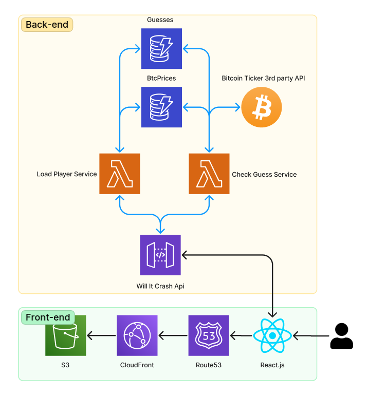

# will-it-crash-api

The front-end repository of this application can be found [here](https://github.com/mdnm/will-it-crash)

This project contains source code and supporting files for a serverless application that you can deploy with the SAM CLI. It includes the following files and folders

- src/models - Entities models of the application.
- src/repositories - Interfaces and implementations of the application's repositories used to access and persist data.
- src/load-player-service - Service used to load the initial game state (`playerId`, `btcPrice` and `timestamp`).
- src/check-guess-service - Service used to check the guess made by the player, persist it's answer and return the new score/game state.
- src/tests - Unit tests for the application code.
- template.yaml - A template that defines the application's AWS resources.

The application uses several AWS resources, including Lambda functions and an API Gateway API. These resources are defined in the `template.yaml` file in this project.



## Deploy

To use the SAM CLI, you need the following tools.

- SAM CLI - [Install the SAM CLI](https://docs.aws.amazon.com/serverless-application-model/latest/developerguide/serverless-sam-cli-install.html)
- Node.js - [Install Node.js 16](https://nodejs.org/en/), including the NPM package management tool.
- Docker - [Install Docker community edition](https://hub.docker.com/search/?type=edition&offering=community)

To build and deploy your application for the first time, run the following in your shell:

```bash
sam build
sam deploy --guided
```

The first command will build the source of your application. The second command will package and deploy your application to AWS, with a series of prompts:

- **Stack Name**: The name of the stack to deploy to CloudFormation. This should be unique to your account and region, and a good starting point would be something matching your project name.
- **AWS Region**: The AWS region you want to deploy your app to.
- **Confirm changes before deploy**: If set to yes, any change sets will be shown to you before execution for manual review. If set to no, the AWS SAM CLI will automatically deploy application changes.
- **Allow SAM CLI IAM role creation**: Many AWS SAM templates, including this example, create AWS IAM roles required for the AWS Lambda function(s) included to access AWS services. By default, these are scoped down to minimum required permissions. To deploy an AWS CloudFormation stack which creates or modifies IAM roles, the `CAPABILITY_IAM` value for `capabilities` must be provided. If permission isn't provided through this prompt, to deploy this example you must explicitly pass `--capabilities CAPABILITY_IAM` to the `sam deploy` command.
- **Save arguments to samconfig.toml**: If set to yes, your choices will be saved to a configuration file inside the project, so that in the future you can just re-run `sam deploy` without parameters to deploy changes to your application.

You can find your API Gateway Endpoint URL in the output values displayed after deployment.

A Github Action CI/CD pipeline is also available in this repo, just make sure you create the following secrets:

- `AWS_ACCESS_KEY_ID`
- `AWS_ACCESS_KEY_SECRET`

## Running and testing locally

Build your application with the `sam build` command.

```bash
$ sam build
```

The SAM CLI installs dependencies defined in `src/package.json`, compiles TypeScript with esbuild, creates a deployment package, and saves it in the `.aws-sam/build` folder.

The SAM CLI can emulate your application's API. Use the `sam local start-api` to run the API locally on port 3000.

```bash
$ sam local start-api
$ curl http://localhost:3000/
```

The SAM CLI reads the application template to determine the API's routes and the functions that they invoke. The `Events` property on each function's definition includes the route and method for each path.

```yaml
# e.g.

Events:
  Guess:
    Type: Api
    Properties:
      Path: /guess
      Method: post
```

## Unit tests

Tests are defined in the `src/tests` folder in this project. Use NPM to install the [Jest test framework](https://jestjs.io/) and run unit tests.

```bash
$ cd src
src$ npm install
src$ npm run test
```

## Cleanup

To delete the sample application that you created, use the AWS CLI. Assuming you used your project name for the stack name, you can run the following:

```bash
aws cloudformation delete-stack --stack-name STACK_NAME
```
